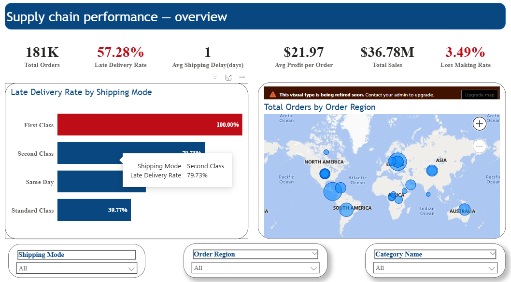
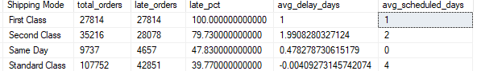
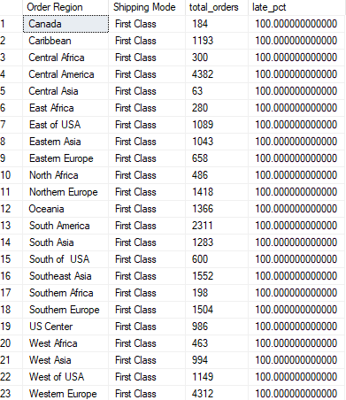
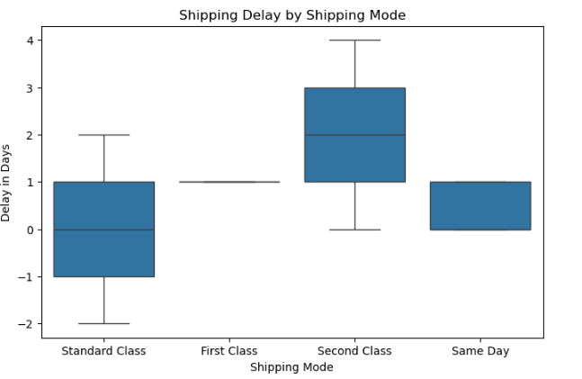
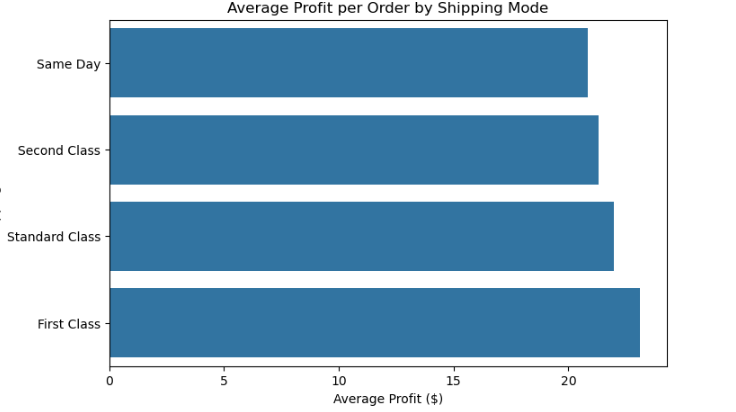
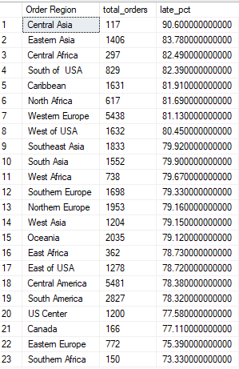
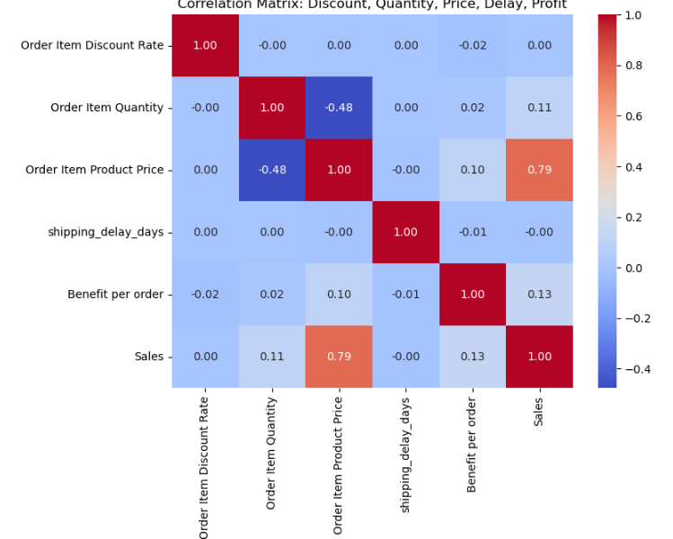
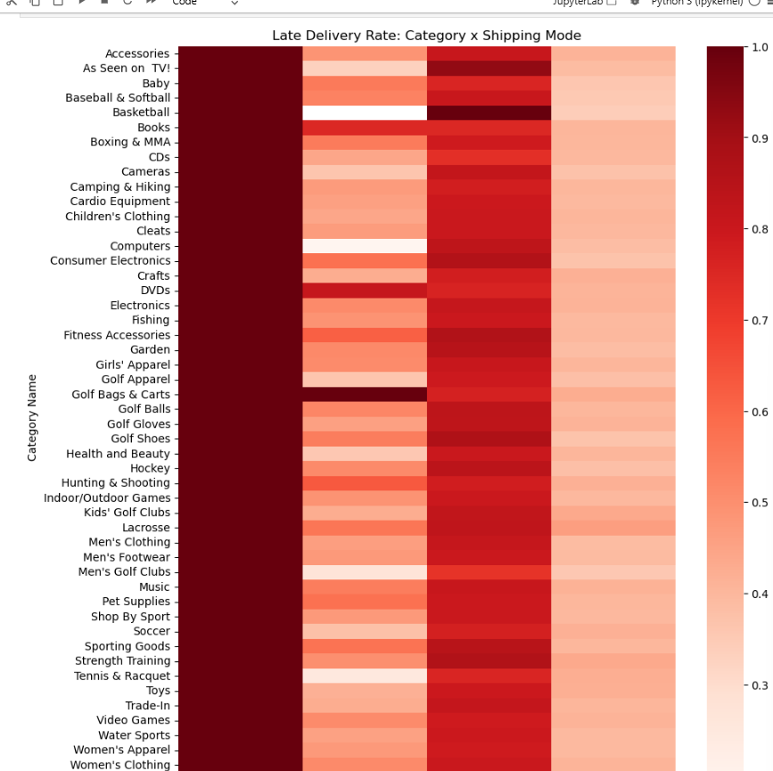
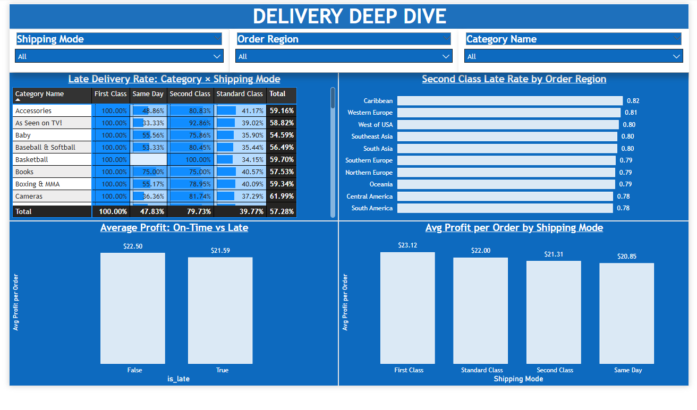
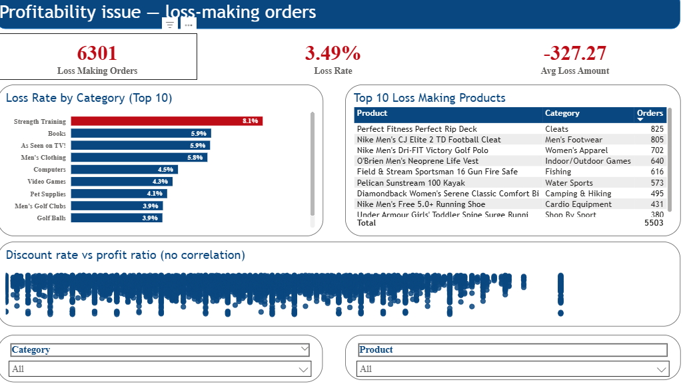

# Supply Chain Performance Dashboard

### Dashboard Link : [Add your published Power BI Service link here]

## Problem Statement

This project helps identify where a supply chain breaks down and which shipping modes, regions, and categories consistently underperform. Using 180,519 orders from the DataCo Supply Chain dataset, the goal was to answer two business questions: **where are the bottlenecks in the supply chain, and which segments consistently underperform?**

Since **57.28% of all orders were delivered late**, and **First Class shipping showed a 100% late-delivery rate with zero exceptions**, the business has a structural, unaddressed delivery problem — not just occasional operational noise. Separately, **3.5% of orders (6,301) lose more money than their own sale value**, a distinct profitability issue independent of delivery performance.

---

## Steps Followed

### Phase 0 — Data Cleaning (Python)

- Step 1: Loaded the raw CSV (180,519 rows × 53 columns) using `pandas`, with `encoding="latin-1"` since the file mixes English and Spanish region labels (e.g. "EE. UU." for United States).
- Step 2: Inspected the dataset — checked dtypes, null counts, and duplicate rows before making any changes.
- Step 3: Dropped columns that were unusable: `Product Description` (99.9% empty), `Order Zipcode` (86% empty), `Customer Email` / `Customer Password` (masked PII, zero information), and `Product Image` (not needed for analysis).
- Step 4: Parsed both date columns (`order date`, `shipping date`) from text into proper datetime fields.
- Step 5: Standardized inconsistent country names (e.g. "EE. UU." → "United States") and trimmed whitespace across all text columns.
- Step 6: Engineered the core bottleneck metric:

      shipping_delay_days = Days for shipping (real) - Days for shipment (scheduled)
      is_late = shipping_delay_days > 0

- Step 7: Cross-checked the dataset's own `Late_delivery_risk` flag against the independently computed `is_late` flag — found **97.55% agreement**, validating both fields as reliable.
- Step 8: Exported the cleaned "gold" dataset for use in SQL, Python EDA, and Power BI, keeping all three tools on a single consistent source.

### Phase 1 — KPI Querying (SQL Server)

- Step 9: Loaded the gold dataset directly into SQL Server using `pandas.to_sql()` via `sqlalchemy`, avoiding CSV-import wizard issues with null handling and column type detection.
- Step 10: Wrote KPI queries to calculate late-delivery rate and average delay, broken out by shipping mode, category, region, order status, customer segment, and year.
- Step 11: Used SQL results to identify the three primary bottlenecks (see Insights below) before building any visuals — SQL served as the "thinking layer" that Python and Power BI both built on top of.

### Phase 2 — Exploratory Data Analysis (Python)

- Step 12: Built univariate distributions for delay, profit, and sales; and categorical spread for shipping mode and region.
- Step 13: Built bivariate comparisons — chart type chosen based on what each relationship needed to show (boxplots for delay-by-mode, since it has no outliers; bar-of-means for profit-by-mode, since profit has 6,301 extreme values that would distort a boxplot).
- Step 14: Ran a correlation analysis across discount rate, quantity, price, delay, and profit — testing (and rejecting) discounting and order size as explanations for the delivery bottlenecks and the loss-making orders.
- Step 15: Investigated an extreme outlier (-$4,274 on a single order), which led to discovering 6,301 similar loss-making orders (3.5% of the dataset) — a genuine secondary finding, not part of the original project plan.
- Step 16: Built a category × shipping mode interaction heatmap, confirming First Class's 100% late rate holds across every product category, not just in aggregate.

### Phase 3 — Interactive Dashboard (Power BI)

- Step 17: Imported the gold dataset into Power BI Desktop; corrected column types in Power Query (several numeric columns had been auto-detected as Text, and boolean columns needed explicit True/False typing).
- Step 18: Created DAX measures for all core KPIs:

      Late Delivery Rate =
      DIVIDE(
          CALCULATE(COUNTROWS(dataco_clean), dataco_clean[is_late] = TRUE()),
          COUNTROWS(dataco_clean)
      )

      Loss Making Rate =
      DIVIDE(
          CALCULATE(COUNTROWS(dataco_clean), dataco_clean[Order Item Profit Ratio] < -1),
          COUNTROWS(dataco_clean)
      )

- Step 19: Built a 3-page report:
  - **Page 1 — Overview:** KPI cards, Late Delivery Rate by Shipping Mode, and a region map (bubble size = order volume).
  - **Page 2 — Delivery Deep Dive:** Category × Shipping Mode heatmap, Second Class late rate by region (top 10 by volume), and profit comparison charts.
  - **Page 3 — Profitability Issue:** Loss rate by category, top loss-making products table, and a discount-rate-vs-profit-ratio scatter plot confirming no correlation.
- Step 20: Applied a consistent corporate-blue theme, with red reserved specifically for whichever data point represented a "bad news" finding on each chart (e.g. First Class's 100% bar, Strength Training's loss rate) — so color does analytical work instead of being decorative.
- Step 21: Added slicers for Shipping Mode, Order Region, and Category on every page, left unfiltered by default so the full dataset is visible on first view.

---

## Insights

### [1] Overall Delivery Performance

**Total Orders = 180,519**
**Overall Late Delivery Rate = 57.28%**

Late delivery rate stayed flat at ~57% across every year from 2015–2017 — the problem is stable and unaddressed, not worsening or improving.

### [2] Bottleneck #1 — First Class Shipping (Structural Failure)

- **100% of First Class orders (27,814) were late** — every region, every product category, zero exceptions.
- Average delay was a fixed 1 day with zero variance, indicating the promised SLA was never achievable rather than a fulfillment failure.

*First Class shows a 100% late rate across all 23 regions individually, confirmed below:*

*A boxplot confirms the flat, zero-variance pattern — First Class sits as a perfectly flat line at 1 day:*

### [3] Bottleneck #2 — Same Day Shipping (Highest Cost of Failure)

- Same Day has a lower late rate (47.8%) than Second Class, but late Same Day orders show a **19.5% profit drop** compared to on-time Same Day orders — roughly 4x the erosion seen in Standard Class.

### [4] Bottleneck #3 — Second Class Shipping (Regional Variance)

- Second Class late rate ranges from **73% to 91%** depending on region.
- **Western Europe (81.1% late, 5,438 orders)** and **Central America (78.4% late, 5,481 orders)** are the highest-priority regions — both combine poor performance with the company's largest order volumes.

### [5] Ruled-Out Factors

The following were tested and found **not** to explain the delivery bottlenecks:

| Factor | Result |
|---|---|
| Product category | Flat 55–62% late rate across all ~50 categories |
| Order status (fraud/cancelled) | Flat 55.6–57.9% across all statuses |
| Customer segment | Nearly identical late rate across Consumer/Corporate/Home Office (57.1–57.5%) |
| Order quantity | No correlation with delay (~0.00) |
| Discount rate | No correlation with profit (-0.02) |

### [6] Secondary Finding — Loss-Making Orders

- **6,301 orders (3.5%)** lose more money than their own sale value — independent of late delivery (58.2% late rate within this group vs. ~57% baseline, not a meaningful difference).
- **Strength Training** is the highest-risk category (8.1% loss rate, more than double the dataset average).
- The **"Perfect Fitness Perfect Rip Deck"** is the single largest contributor, with 825 loss-making orders.

### [7] Power BI Dashboard Pages

---

## Recommendations

1. **First Class:** Revise the SLA to a realistic delivery window, or audit the fulfillment process to find the fixed bottleneck preventing any order from meeting the current 1-day target.
2. **Same Day:** Treat as a high-priority risk despite lower frequency — the cost per failure is the highest of any shipping mode.
3. **Second Class:** Focus operational improvement in Western Europe and Central America first, since they combine poor performance with the largest order volumes.
4. **Profitability:** Review pricing/cost structure for the Strength Training category, starting with the Perfect Fitness Perfect Rip Deck.

---

## Tools Used

- **SQL Server** — KPI querying and validation
- **Python (Pandas, Seaborn, Matplotlib)** — data cleaning, EDA, correlation and hypothesis testing
- **Power BI** — interactive 3-page dashboard with DAX measures, slicers, and a region map
